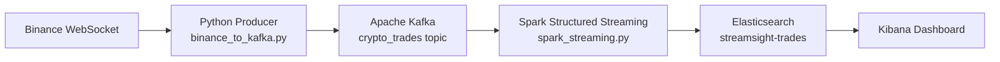

# STREAMSIGHT — Real-Time Crypto Anomaly Detection Pipeline


## What is this

STREAMSIGHT is a real-time market analytics pipeline that ingests live BTC/USDT trades and detects anomalies using windowed VWAP + Z-score logic. It exists to demonstrate production-style data engineering across streaming ingestion, transformation, and observability layers.

## Why it exists

Most notebook-based projects stop at offline analysis; this project demonstrates end-to-end operational behavior: real-time ingestion from Binance, stream processing with Spark, indexed outputs in Elasticsearch, and monitoring in Kibana.

## Architecture / Stack



**Core stack:** Python, Kafka, Spark Structured Streaming, Elasticsearch, Kibana, Docker Compose.

## Installation

### 1) Clone repository

```powershell
git clone https://github.com/fbenkhelifa/streamsight.git
cd streamsight
```

### 2) Create Python environment and install dependencies

```powershell
python -m venv venv
.\venv\Scripts\Activate.ps1
pip install -r requirements.txt
```

### 3) Start infrastructure

```powershell
docker compose up -d
docker compose ps
```

### 4) Create Elasticsearch index mapping

```powershell
.\create_es_index.ps1
```

### 5) Start producer (terminal 1)

```powershell
.\venv\Scripts\Activate.ps1
python binance_to_kafka.py
```

### 6) Start Spark streaming (terminal 2)

```powershell
$env:JAVA_HOME = "C:\Program Files\Eclipse Adoptium\jdk-17.0.18.8-hotspot"
$env:SPARK_HOME = "C:\spark\spark-3.5.7-bin-hadoop3"
$env:HADOOP_HOME = "C:\hadoop"
$env:PYSPARK_PYTHON = ".\venv\Scripts\python.exe"
$env:PYSPARK_DRIVER_PYTHON = ".\venv\Scripts\python.exe"
$env:PATH = "$env:JAVA_HOME\bin;C:\hadoop\bin;$env:SPARK_HOME\bin;$env:PATH"

spark-submit `
  --packages org.apache.spark:spark-sql-kafka-0-10_2.12:3.5.7,org.elasticsearch:elasticsearch-spark-30_2.12:8.11.4 `
  spark_streaming.py
```

### 7) Open dashboard

- Kibana: `http://localhost:5601`
- Elasticsearch count check: `http://localhost:9200/streamsight-trades/_count`

## Usage

### Input (example trade from stream)

```json
{"symbol":"BTCUSDT","price":64200.10,"quantity":0.015,"event_time":1711581000000}
```

### Output (windowed analytics record)

```json
{
  "symbol":"BTCUSDT",
  "window_start":"2026-03-28T12:00:00Z",
  "window_end":"2026-03-28T12:00:10Z",
  "total_volume":2.341,
  "trade_count":125,
  "vwap":64197.83,
  "zscore":2.34,
  "is_anomaly":true,
  "anomaly_type":"HIGH_VWAP"
}
```

## Project structure

```text
streamsight/
├── binance_to_kafka.py           # WebSocket producer → Kafka topic
├── spark_streaming.py            # Streaming analytics + anomaly detection
├── setup_kibana.py               # Programmatic Kibana setup helper
├── create_es_index.ps1           # Elasticsearch index mapping bootstrap
├── docker-compose.yml            # Kafka/Zookeeper/Elasticsearch/Kibana stack
├── kibana_dashboard.ndjson       # Exported Kibana dashboard objects
├── requirements.txt              # Python dependencies
├── docs/
│   ├── PERSISTENCE_RUNBOOK.md
│   ├── PRESENTATION_GUIDE.md
│   ├── PROJECT_EXPLANATION.md
│   ├── kibana_setup.md
│   ├── runbook.txt
│   └── technical_report.md
├── .gitignore
└── LICENSE
```

## Limitations

- Current setup is optimized for local single-node execution (not production cluster mode).
- Elasticsearch security is disabled for local development convenience.
- Pipeline currently tracks BTC/USDT only; no symbol multiplexing yet.
- Unit tests are not yet implemented for stream transformations.

## Roadmap

1. Add automated tests for transformation and anomaly logic.
2. Add configurable multi-symbol ingestion and topic partitioning.
3. Add containerized Spark execution profile for easier reproducibility.
4. Add alerting hooks (Slack/Email/Webhook) for anomaly events.
5. Add benchmark section (latency, throughput, and failure-recovery behavior).

## License

Licensed under MIT. See [`LICENSE`](./LICENSE).
